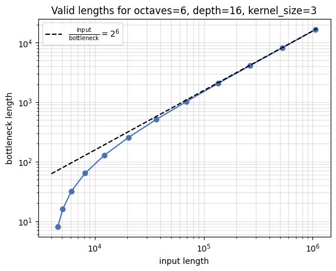
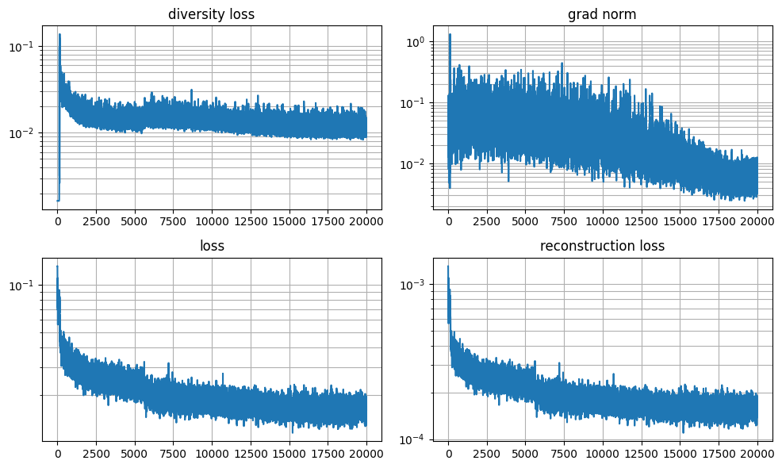

# vq-vae
A [`jax`](https://jax.readthedocs.io/en/latest)/[`nnx`](https://flax.readthedocs.io/en/latest/why.html) implementation of 
[Vector Quantized Variational Autoencoders](https://arxiv.org/abs/1711.00937) for audio compression, using the 
Gumbel-Softmax approach from [wav2vec 2.0](https://arxiv.org/abs/2006.11477) instead of nearest-neighbor lookup. 

## Why vector quantize?
Raw audio is notoriously difficult to model due to its extremely high dimensionality. For example, at the common sampling 
rate of 44.1 KHz and 16 bits of amplitude resolution, 1 minute of stereo audio amounts to over 5 million samples, or 10 MB! 
That far exceeds the maximum sequence length of standard Transformers, and would take around an hour to generate 
autoregressively at a highly optimistic 1000 tokens per second. 

VQ-VAEs can be used to (lossily) compress the bandwidth (bits per second) of raw audio. They address the problem on both fronts:
1. They compress along the time dimension -- the sampling rate (in Hz) of the compressed waveform is drastically reduced
2. They compress along the bit depth dimension -- each sample is represented by fewer bits

A VQ-VAE consists of an encoder, a decoder, and some form of differentiable quantization at the bottleneck. The quantized codes
can be represented as integers with some number of bits, and can be transmitted much more cheaply than the raw signal, provided 
that the decoder is already present on the receiver side. 

## Why Gumbel-Softmax?
VQ-VAEs use a codebook (embedding lookup) to model the discrete representations in the compressed space. The codebook entries
are updated with gradient descent to optimize the reconstruction quality. The original VQ-VAE paper used nearest-neighbor lookup 
during the forward pass, with a straight-through estimator for the gradients. 

In practice this can result in codebook entries that, perhaps due to the distribution of their initial values relative to the 
queries, never get used. While the codebook and commitment loss terms of VQ-VAE encourage the codebook entries and queries to 
lie close to their assigned neighbors, they do not directly address the problem of "dead" codes, and practitioners are left to 
rely on kludges like reseting codebook entries to random query values at regular intervals. 

Here we bypass nearest-neighbor lookup entirely, and instead predict the parameters of a categorical distribution over codes. 
This enables us to control a few properties directly:
* We can maximize the entropy of the expectation over the minibatch, to ensure codes are used efficiently
* We can introduce some controlled randomness by sampling, inducing robustness in the decoder

Like the standard VQ-VAE, we employ a straight-through estimator to enable backpropagation through the quantization. 
Sampling is enabled via [the Gumbel-Softmax distribution](https://arxiv.org/abs/1611.01144), which is continuously differentiable
with respect to its parameters:
```python
def gumbel_softmax(
    key: jax.Array, 
    logits: jax.Array, 
    *,
    hard: bool,
    temperature: float = 1.0, 
    axis: int = -1,
) -> jax.Array:
    logits += jax.random.gumbel(key, logits.shape)
    probs = nnx.softmax(logits / temperature, axis=axis)
    if not hard:
        return probs
    index = probs.argmax(axis)
    onehot = nnx.one_hot(index, probs.shape[axis], axis=axis, dtype=probs.dtype)
    straight_through = probs + jax.lax.stop_gradient(onehot - probs)
    return straight_through
```

## Architecture
In order to encode and decode sequences of arbitrarily different lengths, and to enable a trade-off between time and memory
during the encoding or decoding of very long sequences, the encoder and decoder are implemented as convolutional networks 
that are translationally equivariant (TE), up to their stride. This means they satisfy $f(g \cdot x) = g \cdot f(x)$, where 
$f$ is the network, $x$ is any valid input sequence, and $g$ is any translation by an integer multiple of $f$'s stride. This 
is accomplished by (in effect) using "valid" boundary conditions in the convolutions, meaning no padding is applied. In 
practice, we use "same" boundary conditions so that the input and output shapes are identical, which enables us to scan 
successive layers over the network's depth. The values affected by padding are then cropped off at the end of the layer stack:
```python
class Backbone(nnx.Module):

    def __init__(self, depth: int, dim: int, kernel_size: int, *, rngs: nnx.Rngs):

        @nnx.split_rngs(splits=depth)
        @nnx.vmap
        def create_block(rngs: nnx.Rngs):
            return ResBlock(dim, kernel_size, rngs=rngs)

        self.p = depth * (kernel_size // 2)
        self.blocks = create_block(rngs)

    def __call__(self, x: jax.Array) -> jax.Array:

        @nnx.scan(in_axes=(0, nnx.Carry), out_axes=nnx.Carry)
        @nnx.remat(prevent_cse=False, policy=jax.checkpoint_policies.save_only_these_names("conv"))
        def forward(block, x):
            return block(x)

        x = forward(self.blocks, x)
        return x[:, self.p:-self.p]
```
In addition to "valid" boundary conditions, we also need to remove any operations that broadcast values over the input 
field, if those values are variable with respect to the inputs. One example of a TE-violating broadcasting operation would 
be layer normalization -- the computed mean and variance are sensitive to the layer's inputs, and they are broadcast over 
the entire input field. Instead we use [SkipInit](https://arxiv.org/abs/2002.10444) to initialize the encoder and decoder
close to the identity function:
```python
class ResBlock(nnx.Module):

    def __init__(self, dim: int, kernel_size: int, *, rngs: nnx.Rngs):
        self.conv = nnx.Conv(dim, 2 * dim, (kernel_size,), param_dtype=default_dtype, rngs=rngs)
        self.alpha = nnx.Param(jnp.zeros((), dtype=default_dtype))

    def __call__(self, x: jax.Array) -> jax.Array:
        x0 = x
        x = self.conv(x)
        x = ckpt(x, "conv")
        x = nnx.glu(x)
        x *= self.alpha
        x += x0
        return x
```
Also note that the convolution operation is explicitly "checkpointed" -- this is an optimization that tells the compiler
*not* to rematerialize the operation, even though we are telling it to rematerialize everything else (because the rest of 
the ops are pointwise and relatively cheap) within the scan. 

---

The encoder and decoder are factored into "octaves": stacks of residual blocks applied at a given timescale. Between octaves,
we exchange data points between the sequence and channels axes via reshaping. One could think of this as a 1d version of the
[PixelShuffle operation](https://arxiv.org/abs/1609.05158). This operation is local, and valid under TE, but it does induce
an overall stride to the network, meaning not all input sequence lengths are valid (e.g. if they are odd when we attempt to 
reshape by a factor of 2 between any two octaves):
```python
class ConvNet(nnx.Module):
    
    def __init__(
        self, 
        direction: str,
        *, 
        octaves: int, 
        depth: int, 
        dim: int, 
        kernel_size: int, 
        rngs: nnx.Rngs,
    ):
        assert direction in ("up", "down")
        self.direction = direction
        self.octaves = octaves
        self.backbones = [Backbone(depth, dim * 2 ** o, kernel_size, rngs=rngs) for o in range(octaves + 1)]
        if self.direction == "up":
            self.backbones = self.backbones[::-1]

    def __call__(self, x: jax.Array) -> jax.Array:
        for i, backbone in enumerate(self.backbones):
            if self.direction == "up" and i > 0:
                x = x.reshape(-1, x.shape[1] * 2, x.shape[2] // 2)
            x = backbone(x)
            if self.direction == "down" and i < self.octaves:
                x = x.reshape(-1, x.shape[1] // 2, x.shape[2] * 2)
        return x
```
We provide a helper method to compute valid input lengths, given a desired bottleneck length:
```python
class VQVAE(nnx.Module):
    ...

    def valid_length(self, bottleneck: int) -> int:
        padding_per_octave = (self.kernel_size - 1) * self.depth
        length = bottleneck + padding_per_octave
        for _ in range(self.octaves):
            length *= 2
            length += padding_per_octave
        return length
```
The ratio between input length and bottleneck length asymptotically approaches the network's stride:



## Training
We use a combination of $L^2$ reconstruction loss and the "diversity loss" from wav2vec 2.0:
```python
def diversity_loss_fn(logits: jax.Array) -> jax.Array:
    codebook_size = logits.shape[-1]
    avg_probs = nnx.softmax(logits).mean((0, 1))
    entropy = -jnp.sum(avg_probs * jnp.log(avg_probs + 1e-7))
    perplexity = jnp.exp(entropy)
    loss = (codebook_size - perplexity) / codebook_size
    return loss
```
We train the model for 20,000 iterations, or about 8 hours, because GPUs are expensive!



When we encode and decode an audio clip (without Gumbel softmax sampling), we find the audio perfectly legible:
* [original](original.wav)
* [round-trip](round-trip.wav)
